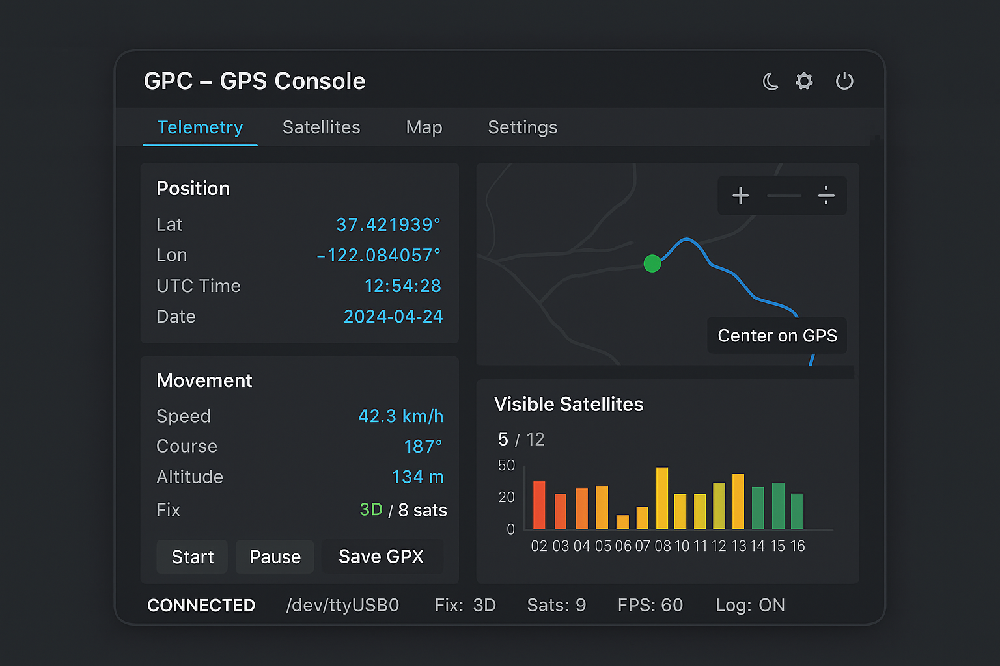

# GPC GUI Tasarım ve Layout Planı

Bu belge, GPC — GPS Parser ve GUI Konsol projesinin görsel arayüz tasarımını tanımlar.  
Tasarım, SDL2 + OpenGL + Dear ImGui tabanlı C uygulamasına yöneliktir ve kullanıcı deneyimi açısından optimize edilmiştir.

---

## 1. Genel Arayüz Yapısı

**Pencere boyutu:** 1024 × 768 px  
**Yaklaşım:** Tek ana pencere (Main Dashboard) + ImGui sekmeleri  
**Tasarım hedefi:** Bilgi yoğun ama sade, okunabilir, modern görünüm

```
┌─────────────────────────────────────────────┐
│ [Menü Çubuğu / Header Bar - 40px]          │
├─────────────────────────────────────────────┤
│ [Ana İçerik Alanı - 688px]                 │
│ ┌──────────────┬────────────────────────┐  │
│ │ Telemetri   │ Harita / Uydu Grafikleri│  │
│ │ (Sol Panel) │ (Sağ Panel)             │  │
│ └──────────────┴────────────────────────┘  │
├─────────────────────────────────────────────┤
│ [Durum Çubuğu / Status Bar - 40px]         │
└─────────────────────────────────────────────┘
```

---

## 2. Menü Çubuğu (Header – 1024×40)

| Eleman | Konum | Açıklama |
|--------|--------|-----------|
| **Logo / Başlık** | Sol | “GPC – GPS Console” |
| **Sekmeler:** Telemetry, Satellites, Map, Settings | Orta | ImGui TabBar |
| **Simgeler:** 🌙 ⚙️ 🔌 | Sağ | Tema, Ayar, Bağlantı kontrolü |

---

## 3. Sol Panel – Telemetry / GPS Data

**Boyut:** 320 × 688  
**İçerik:**

- Lat, Lon, UTC Time, Date
- Speed, Course, Altitude
- Fix Status (3D, 2D, No Fix)
- Logging (ON/OFF)
- Butonlar: Start, Pause, Save GPX

> Görsel: Dijital sayaç stili, açık renkli monospace font.

---

## 4. Sağ Panel – Harita / Uydu / Grafik Alanı

**Boyut:** 704 × 688  
**Bölünme:**

- Üst: Harita / Track View (704×400)
  - Güncel konum noktası
  - Geçmiş track çizgisi
  - Zoom (+/−)
  - Center on GPS butonu
- Alt: Uydu Sinyal Grafikleri (704×288)
  - SNR histogramı
  - ID başlıkları
  - Yeşil/Sarı/Kırmızı tonlar

---

## 5. Durum Çubuğu (Status Bar – 1024×40)

```
[CONNECTED] Port: /dev/ttyUSB0 | FIX: 3D | Sats: 9 | FPS: 60 | Log: ON
```

Renk kodları:  

- Bağlantı: Yeşil  
- Hata: Kırmızı  
- Yazı: Gri / monospaced

---

## 6. Renk ve Tipografi

| Öğe | Renk | Not |
|------|------|------|
| Arka Plan | #1E1E1E | Karanlık tema |
| Panel Yüzeyi | #2B2B2B | Hafif açık ton |
| Vurgu | #0096FF | Aktif sekmeler |
| Uyarı | #FFB000 | Fix bekleniyor |
| Hata | #FF4444 | Port yok |
| Yazı | #DADADA | Açık gri |

Font: **Menlo / JetBrains Mono**

---

## 7. ImGui Teknik Notlar

- `ImGuiConfigFlags_DockingEnable` aktif olacak.
- Her panel ayrı `ImGui::Begin()` konteynerinde olacak.
- Harita paneli `NoScrollbar | NoCollapse` flag’leriyle sabitlenir.
- Status bar `ImGui::SetNextWindowPos()` ile sabitlenir.

---

## 8. Gelişmiş Özellik Planı

- Dockable paneller
- Tema değiştirici (Dark / Light)
- Mini HUD görünümü
- Multi-device monitoring
- Responsive layout (1280×720 ve üzeri destek)

---

## 9. Görsel Referans

Aşağıdaki görsel, bu layout’un genel görünümünü temsil eder:



---

**Hazırlayan:** Hakan Kılıçaslan  
**Tarih:** 2025-10-18  
**Durum:** Görsel tasarım aşaması (işlevsel entegrasyon bekleniyor)
